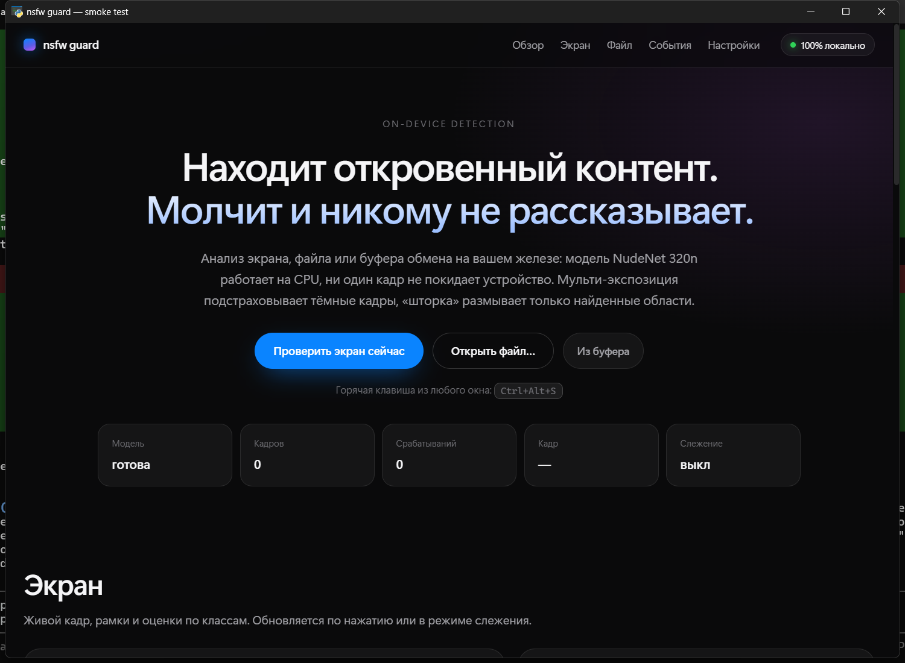

# nsfw-guard

[](https://github.com/rizanrv/nsfw-guard/actions/workflows/ci.yml)


On-device nudity detection for **screens**, **files** and the **clipboard**, with a
dark desktop UI. The engine is NudeNet 320n on ONNX Runtime (CPU); the interface is
a plain HTML/CSS/JS page rendered inside a WebView2 window, bridged to Python.

**Nothing leaves the machine.** No telemetry, no uploads, no update checks - the
model ships inside the `nudenet` wheel and inference happens locally.



## Highlights

* **Whole-screen analysis** with detection boxes drawn on the preview, plus watch
  mode with a configurable interval.
* **Per-region curtain** - only the flagged regions are covered, with blurred copies
  of those pixels in a click-through overlay window. It closes itself.
* **Multi-exposure inference** for dark frames: the frame is analysed as-is and on
  gamma-lifted copies, and the results are merged by class + IoU. This recovers
  detections that a single pass misses on dim screens.
* **File, clipboard and drag-and-drop** analysis; `Ctrl+V` works too.
* **Global hotkey** `Ctrl+Alt+S` - analyse the current screen from any window.
* **Class-level control** - pick exactly which of the 18 model classes count as
  explicit, with presets (`EXPOSED`, defaults, all).
* **CLI mode** for scripting and for machines without a desktop session.
* **Event log** of metadata only (time, source, class, score, duration).

## Privacy

| Claim | How to check |
| --- | --- |
| No network code | `grep -rn "requests\|urllib\|socket\|http" nsfw_guard/` returns nothing but a comment |
| Model is local | `python -c "import nudenet,os;print(os.path.dirname(nudenet.__file__))"` - `320n.onnx` (11.6 MB) sits inside the package |
| No traffic while running | run the app, then compare `netstat -ano`/Wireshark before and after - the process opens no sockets |
| Frames are not stored | files are only written when you enable the corresponding switch (data folder below) |

Local data directory (logs, optional flagged frames, curtain patches):

* Windows: `%LOCALAPPDATA%\nsfw-guard`
* Linux/macOS: `~/.local/share/nsfw-guard`
* override with the `NSFW_GUARD_HOME` environment variable

## Install

```bash
git clone https://github.com/rizanrv/nsfw-guard.git
cd nsfw-guard
python -m pip install -r requirements.txt      # or: python -m pip install -e .
```

The desktop UI needs the WebView2 runtime on Windows (present on Windows 11 and on
most Windows 10 machines); the CLI works without it. On Linux/macOS `pywebview`
uses the system WebKit backend.

## Usage

### Desktop UI

```bash
python -m nsfw_guard        # after pip install -e . you can also run: nsfw-guard
```

* hero buttons: **check the screen**, **open a file**, **from the clipboard**
* watch switch with an interval stepper (1-120 s) and a monitor picker
* class chips with presets, threshold slider, toggles for curtain / sound / saving
* frame preview with boxes, detection list with score bars, event log and raw log

### Global hotkey

`Ctrl+Alt+S` analyses the current screen from any window (polled through
`GetAsyncKeyState`, no global hooks are installed).

### CLI

```bash
python -m nsfw_guard --cli --screen                     # one screenshot
python -m nsfw_guard --cli --file photo.jpg --json      # machine readable
python -m nsfw_guard --cli --clipboard
python -m nsfw_guard --cli --watch --interval 2         # until Ctrl+C
python -m nsfw_guard --cli --list-monitors
python -m nsfw_guard --cli --file dark.jpg --no-multi   # single exposure
```

## How it works

```
nsfw_guard/
  core.py       engine: model, capture, clipboard, alerts, curtain, stats
  server.py     desktop shell (pywebview window + JS bridge), no local HTTP server
  curtain.py    short-lived process drawing blurred patches over flagged boxes
  cli.py        terminal interface
  webui/        index.html + styles.css + app.js (no frameworks, no CDN)
tools/
  synth_dataset.py   synthetic YOLO dataset of hard negatives
  evaluate.py        per-class and per-brightness precision/recall report
tests/
  test_smoke.py      headless unit tests with real inference
  ui_smoke.py        opens the window, exercises the JS bridge, screenshots it
```

The page polls `get_state()` over the bridge; every analysis runs on the Python
side, and the UI talks to nothing except that bridge. Widgets are never touched
from worker threads - results travel as plain JSON.

### Multi-exposure (dark frames)

A single 320px pass is unreliable when the screen is dim. Each frame is therefore
analysed up to three times - as-is, and with gamma lifts of 1.8 and 3.2 - and the
detections are merged per class with IoU >= 0.5 (highest score wins). Cost: ~3x
inference (~60 ms per frame on a modern CPU), benefit: detections that would
otherwise be missed in dark scenes.

### Curtain

When a frame triggers, only the flagged regions are covered: those pixels are
cropped, blurred, darkened and saved as small PNGs; a separate process paints them
in a topmost window whose background is a chroma key, so the rest of the screen
stays visible and clickable. The overlay closes by itself after N seconds.

## Settings

| Setting | Default | Meaning |
| --- | --- | --- |
| `threshold` | `0.35` | score above which a detection of an explicit class triggers |
| `explicit` | 5 classes | `*_EXPOSED` genitalia/breast/buttocks/anus |
| `multi` | `True` | multi-exposure inference for dark frames |
| `monitor` | `1` | `0` = all screens, `1..N` = one screen |
| `interval` | `3.0` | watch interval in seconds |
| `curtain` | `True` | blur only the flagged regions |
| `curtain_seconds` | `4` | how long the curtain stays |
| `sound` | `True` | system alert sound |
| `save` | `False` | store the triggering frame in `flagged/` |
| `log_all` | `False` | log clean checks as well |

## Quality measurement and training

Two offline helpers live in `tools/` (see [tools/README.md](tools/README.md)):

```bash
python tools/synth_dataset.py --out dataset --negatives 200      # hard negatives
python tools/evaluate.py --images dataset/images --names dataset/dataset.yaml
```

`evaluate.py` reports precision / recall / F1 per class and the same numbers split by
image brightness, so dark-frame regressions become measurable instead of anecdotal.
On the synthetic negative set (116 dark / skin-tone frames, multi-exposure on):

```
images: 116  detections: 2  triggered: 2  avg 63 ms  passes: multi  threshold: 0.35

brightness bucket        images  triggered  TP  FP  FN   recall  precision
dark   (<0.25)             82          1   0   1   0     0.00       0.00
dim    (0.25-0.5)          29          1   0   1   0     0.00       0.00
normal (0.5-0.75)           5          0   0   0   0     0.00       0.00
```

Two false positives out of 116 hard negatives (1.7 %), both in dark frames.

**Boundary:** this project does not generate and does not scrape explicit material.
The dataset tooling is deliberately limited to hard negatives (skin tone, mosaic,
dark / noisy / blurred / compressed frames) and to photometric degradations of images
you already own. A fine-tune is worth it precisely because most real-world pain comes
from false positives, and those are fixable with negatives alone. If you want to train
on explicit imagery, use a properly licensed, hand-labelled dataset that you are
legally allowed to use - and keep it out of this repository.

## Limitations

* A general-purpose nudity detector: expect false positives on skin tone, close-ups,
  statues and medical images, and false negatives on stylised, illustrated, heavily
  edited or very small content.
* It is an aid for your own screen, not a parental-control product and not a
  substitute for a conversation. Classification is imperfect by nature.
* Windows is the primary target (capture, hotkey, curtain). Core and CLI are portable.
* Use it on your own screen, or where the people involved agreed to it.

## Development

```bash
python -m unittest discover -s tests -v     # headless tests with real inference
python tests/ui_smoke.py                    # opens the UI, checks the bridge, screenshots it
```

`tests/ui_smoke.py` reads back what the page actually sees (`window.__nsfwGuard`), so
a broken bridge cannot pass silently. CI runs the headless suite on Windows for
Python 3.10 and 3.12 and builds the package.

## License

MIT - see [LICENSE](LICENSE). The detection model comes from the
[NudeNet](https://github.com/notAI-tech/NudeNet) package (upstream is AGPL-3.0);
check that project's license before redistributing the model itself.

---

## Русский

**nsfw-guard** - локальный детектор откровенного контента для экрана, файлов и буфера
обмена. Модель NudeNet 320n считает на CPU, интерфейс - тёмное окно в стиле apple.com
(HTML/CSS/JS внутри WebView2, без фреймворков и CDN).

* `python -m nsfw_guard` - графический интерфейс, `python -m nsfw_guard --cli --help` - терминал.
* Горячая клавиша `Ctrl+Alt+S` проверяет текущий экран из любого окна.
* Тёмные кадры: мульти-экспозиция (гамма 1.0 / 1.8 / 3.2 и слияние по IoU).
* «Шторка» размывает **только** найденные области и закрывается сама.
* Сети нет: модель внутри пакета `nudenet`, логи и данные - локально
  (`%LOCALAPPDATA%\nsfw-guard`), кадры пишутся только при включённом переключателе.
* Проект **не генерирует** и не собирает откровенный контент: инструменты в `tools/`
  делают «сложные негативы», чтобы убирать ложные срабатывания.

Используйте на своём экране или с согласия людей. Лицензия MIT.
